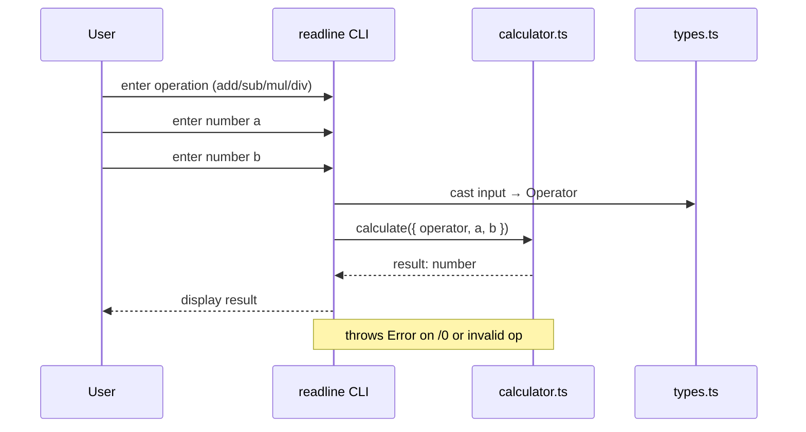

# NEETCODE — ts101: TypeSafe Calculator

## N — Nature / Overview

A CLI-based type-safe calculator built with TypeScript. Teaches: types, interfaces, union types, compiler setup, tsconfig, unit testing.

**Role**: Foundation project — establishes the base TypeScript workflow.

---

## E — Execution Flow (Sequence Diagram)



---

## E — Edge Cases

| Scenario | Handling |
|----------|----------|
| Division by zero | Throws `"Cannot divide by zero"` |
| Invalid operator string | Throws `"Invalid operator"` |
| Non-numeric input | `readline` returns string; cast to number |
| Unknown type cast | Operator input is cast directly (no runtime validation) |

---

## T — Type System & Complexity

**Type constructs used**: `interface Operation`, `type Operator` (union of literals)

**Time complexity**: All operations are O(1)

**Space complexity**: O(1)

---

## C — Core Patterns (Design Patterns)

| Pattern | Usage |
|---------|-------|
| **Module / Separation of Concerns** | types.ts → calculator.ts → index.ts |
| **Pure Function** | `calculate()` has no side effects |
| **Defensive Programming** | Throws on invalid inputs |

---

## O — Optimization Notes

- No performance bottlenecks (trivial O(1) operations)
- Can extend operators without modifying `calculate()` signature (new case + union member)
- Runtime input validation is minimal — consider Zod for production

---

## D — Dependencies & Config

| Dependency | Version | Purpose |
|------------|---------|---------|
| TypeScript | ^5.9.3 | Compiler |
| Jest | ^30.2.0 | Testing |
| ts-jest | ^29.4.5 | Jest transformer |
| ts-node | ^10.9.2 | Direct execution |
| del-cli | ^7.0.0 | Clean builds |

---

## E — Evaluation / Testing

```
npm test   → 6 tests pass
npm run build → tsc compiles cleanly
npm start  → CLI runs with readline
```
